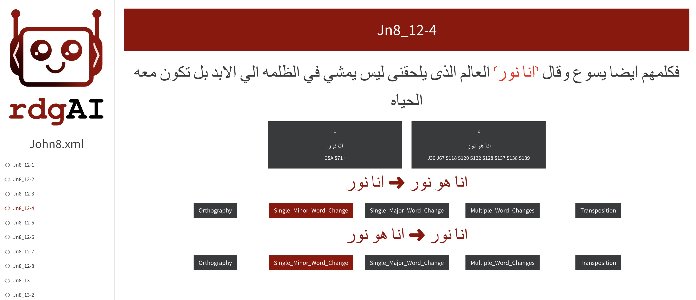

=====================================
Preparation
=====================================

This section describes how to prepare your TEI XML file for classification with Rdgai.

Language Specification
-----------------------------------

Make sure your TEI XML file ``<text>`` element includes the ``xml:lang`` attribute using `Best Current Practice (BCP) 47 <https://www.rfc-editor.org/info/bcp47>`_ code. 
The list of codes is available at the `IANA Language Subtag Registry <https://www.iana.org/assignments/language-subtag-registry/language-subtag-registry>`_ 
or in the Rdgai repository.

For example, for Arabic:

.. code-block:: xml

    <text xml:lang="ar">

Defining Classification Categories
-----------------------------------
Categories are defined in the TEI XML header under the ``<interpGrp type="transcriptional">`` element at the top of the ``<text>`` element. 

Each category is defined by an ``<interp>`` element with a unique ``xml:id`` attribute.
Provide a description of the category in the content of the ``<interp>`` element. 
The description should explicitly define the category. 
It will be used by the LLM to classify transitions between variant readings.

For example:

.. code-block:: xml

    <interpGrp type="transcriptional">
      <interp xml:id="Orthography">Changes in spelling or orthography. This includes any alterations to how words are written without affecting their meaning, such as standardizing spelling or correcting errors. Also includes adding or removing an alif as a marker of the accusative or at the end of a plural verb. Changes to the diacritics for a final ي or ى can be ignored. If the change affects the meaning or grammatical function of the word (such as the form of a verb), then it is more significant than an orthographic change and should not be in this category.</interp>
      <interp xml:id="Single_Minor_Word_Change">An addition, omission or substitution to a single minor word or part of a word. A minor word means a conjunction, pronoun, demonstrative pronoun (e.g. ذلك), pronominal suffix, definite article, preposition, interrogative particle (such as 'ما') or other particle (such as 'قد'). This includes the expansion or contraction of a word and changes to verb form, such as modifications in verb tense, form, or voice, including changes to person or number and transformations between participle and verb. If the root word is the same but the number changes, then it falls in this category. It can still be in this category if the change affects the meaning substantially, so long as it is only affecting the part of speech described here or it does not change the root of the word. If there are changes to multiple words between readings (even if they are minor), then it should not be in this category but it is under 'Multiple_Word_Changes'. If there are multiple minor changes to a single word, then it can still be a Single_Minor_Word_Change.</interp>
      <interp xml:id="Single_Major_Word_Change">An addition, omission or substitution to a single word that is more significant than a conjunction, pronoun, pronominal suffix, definite article, preposition, or particle (such as 'قد'). It is only a major word change if the root of the word is different. If a word is changed to a different form of the same root, then it is a Single_Minor_Word_Change. If the two readings are identical except for a difference in a single major word, then it is in this category (even if the readings otherwise contain multiple words).</interp>
      <interp xml:id="Multiple_Word_Changes">Changes across more than one word. Words can be major or minor. Even if the changes are minor, if multiple words are changed, then it falls in this category. If more than one word is added or omitted, then it is in this category.</interp>
    </interpGrp>

Categories can be:
- **Symmetrical:** A transition between A and B belongs to the same category regardless of direction. These do not have a 'corresp' attribute (like the categories above)
- **Reciprocal:** A transition from A to B has an inverse category for B to A. These have a 'corresp' attribute that points to the corresponding category.

For example:

.. code-block:: xml

    <interpGrp type="transcriptional">
        <interp xml:id="Addition" corresp="#Omission">An addition of a word or words.</interp>
        <interp xml:id="Omission" corresp="#Addition">An omission of a word or words.</interp>
        <interp xml:id="Substituion">A substitution of a word or words.</interp>
    </interpGrp>

Graphical User Interface (GUI)
-----------------------------------

Users can classify transitions via the Rdgai GUI by clicking buttons corresponding to each category or navigating through units using the keyboard.

Launch the GUI with the following command:

.. code-block:: bash

    rdgai gui apparatus.xml output.xml

This will launch a Flask server that you can visit in your browser. 
This will have a page for each variation unit and each page will show all the non-redundant pairs of readings in the variation unit.
You can click on the buttons corresponding to each category. Rdgai will automatically assign the inverse category for reciprocal pair of readings.

The output will be saved to the file ``output.xml``.

If you want to save directly to the input file, you can use the ``--inplace`` flag:

.. code-block:: bash

    rdgai gui apparatus.xml --inplace

This output can be saved into a static HTML file for viewing the current state of the classifications.

.. code-block:: bash

    rdgai html apparatus.xml apparatus.html

.. note::
    
    The HTML file is not interactive and is intended for viewing only. You cannot save changes back to the TEI XML file from the HTML file.

Excel Export/Import
-----------------------------------
Classifications can be exported to Excel for collaborative editing and then imported back into TEI XML.

Export to Excel with the following command:

.. code-block:: bash

    rdgai export apparatus.xml reading-pairs.xlsx

This will create an Excel file with a row for each non-redundant pair of readings in the apparatus:

There are columns to add classifications for each pair of readings. It has a drop down menu with the categories defined in the TEI XML.

There is a column to add a description justifying the classification.

There is also a speadsheet which shows the current number of classifications in each category.

Import the Excel file back into the TEI XML with the following command:

.. code-block:: bash

    rdgai import-classifications apparatus.xml reading-pairs.xlsx output.xml

Displaying the classifications
-----------------------------------

You can display the classifications in the TEI XML on the command line as follows:

.. code-block:: bash

    rdgai classified-pairs apparatus.xml

This will display the classification pairs in the TEI XML by category:

.. image:: ./img/rdgai-classified-pairs.png
    :alt: Rdgai Classified Pairs

Previewing the Prompt Preamble
-----------------------------------

Most of the initial part of the prompt template for a given document is the same for all queries which allows Rdgai to advantage of prompt caching by models which allow for it.
You can preview the prompt preamble for a given document with the ``prompt-preamble`` command:

.. code-block:: bash

    rdgai prompt-preamble apparatus.xml

You can set the number of examples per category with the ``--examples`` flag. The default is 10.

Cleaning TEI XML
-----------------------------------

You can clean the TEI XML file with the following command:

.. code-block:: bash

    rdgai clean apparatus.xml output.xml

Cleans a TEI XML file for common errors, particularly in ``listRelation`` and ``relation`` elements.

This ensures compliance with TEI conventions by:
1. Prepending a ``#`` to the ``ana`` attribute of ``relation`` elements if missing.
2. Consolidating duplicate ``relation`` elements with the same ``active`` and ``passive`` attributes by merging their ``ana`` values.
