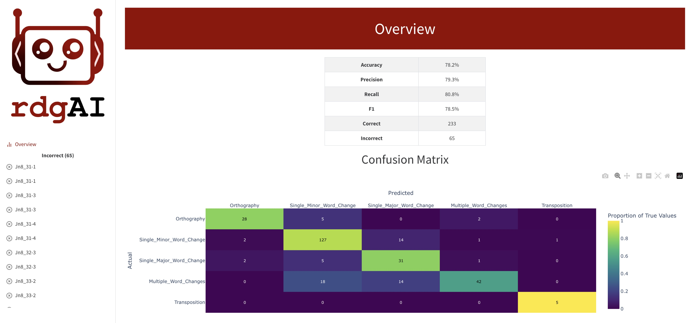

=====================================
Validation
=====================================

The accuracy of Rdgai is dependent on the type of text, the categories and their definitions and the LLM used. 
The accuracy needs to be validated on each document used with Rdgai. 
For this purpose, Rdgai comes with a validation tool which assigns a proportion of the manual annotations to be allowed for use in the prompt 
and the remainder are used as ground truth annotations for evaluating the results from Rdgai. 

Runnning the validation tool
-----------------------------------

To run the validation tool, use the following command:

.. code-block:: bash

    rdgai validate apparatus.xml output.xml --report output.html

That will take 50% of the ground truth annotations to use as examples in the prompt and the other 50% to classify using the LLM and to compare with the ground truth.

You can changed the proportion of annotations to use for evaluation with the ``--proportion`` flag.

The output XML file will have the classifications from the LLM added to the TEI XML file.

Choice of LLM
-----------------------------------

You can choose the LLM to use with the ``--llm`` flag. It can currently accept model names from OpenAI, Anthropic and Llama. Here are some examples:

- gpt-4o
- gpt-4o-mini
- claude-3-5-haiku-20241022
- claude-3-5-sonnet-20241022
- meta-llama/Llama-3.3-70B-Instruct

For the preliminary evaluation of Rdgai on an Arabi textual tradition, the best performing model was claude-3-5-sonnet-20241022. See the article for more details.

For the closed access models, you can set an API key with the ``--api-key`` flag or just set them as the standard environment variables for the vendor.

Choice of number of examples
-----------------------------------

You can set the number of examples per category with the ``--examples`` flag. The default is 10. 
It may be good to explore the effect of changing this number on the accuracy of the LLM.

HTML Report
-----------------------------------

It creates an HTML report  showing the accuracy, macro precision, recall and F1 scores, a confusion matrix and a complete list of all the correct and incorrect classifications, 
showing the ground truth classification, the predicted category from Rdgai and the justification given. 
The report includes the base prompt including the representative example for each category. 

The report also includes a prompt explaining the report in textual format. 
This is given to the LLM to review. 
The LLM then gives suggestions for clarifying the definitions of the categories and alerts the user to any inconsistencies in the ground truth annotations. 
The response of the LLM is included in the HTML report.

The HTML report includes all the correct and incorrect classifications, showing the ground truth classification, the predicted category from Rdgai and the justifications given.

Evaluation of classified XML Files
-----------------------------------

If you have a TEI XML file with classifications from Rdgai already, you can use the ``evaluate`` tool to build an HTML report:

.. code-block:: bash

    rdgai evaluate predictions.xml ground_truth.xml --report output.html

